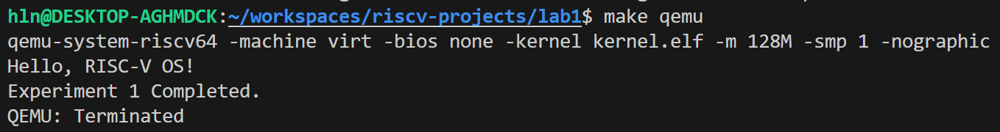

# 综合实验报告：实验1 - RISC-V 引导与裸机启动

## 第一部分：系统设计 (System Design)

### 1.1 架构设计说明
本实验实现了操作系统的最底层引导逻辑，整体流程如下：
1.  **QEMU 加载**：QEMU 模拟器将 `kernel.elf` 加载到物理内存 `0x80000000` 处。
2.  **汇编引导 (`entry.S`)**：
    *   作为 ELF 文件的入口点 (`_entry`)。
    *   设置栈指针 (`sp`)，使其指向预留的 `.bss` 段空间。
    *   跳转至 C 语言主函数。
3.  **内核初始化 (`start.c`)**：
    *   调用 UART 驱动进行硬件初始化（本阶段仅需直接写寄存器）。
    *   向串口发送字符串证明系统存活。
    *   进入死循环防止程序跑飞。

**内存布局方案：**
根据 `kernel/kernel.ld` 的定义，内存布局如下：
*   `0x10000000`: **UART0 基地址** (MMIO，直接映射到硬件寄存器)。
*   `0x80000000`: **内核代码段 (.text) 起始位置**。
*   `Stack`: 位于 `.bss` 段中，大小为 4KB，向低地址增长。

### 1.2 关键数据结构
**1. 启动栈 (`stack0`)**
```c
// 定义在 kernel/start.c
__attribute__ ((aligned (16))) char stack0[4096];
```
*   **作用**：C 语言函数的运行依赖于栈帧（保存局部变量、返回地址等）。在裸机环境中，硬件不提供栈，必须由软件显式分配一段内存并让 `sp` 寄存器指向它，C 代码才能运行。

### 1.3 与 xv6 的对比分析

| 功能模块 | xv6 原版实现 | 我的实现 (RISC-V OS) | 简化/设计理由 |
| :--- | :--- | :--- | :--- |
| **启动方式** | 包含 Bootloader，支持多核启动 (hart0 + others) | 直接通过 QEMU `-kernel` 加载，单核启动 | 简化启动流程，专注于理解核心内核初始化，避免处理复杂的多核竞争。 |
| **UART 驱动** | 完整的 16550a 驱动，包含中断控制、FIFO 管理 | 极简轮询模式 (Polling) | 实验1阶段尚未实现中断，仅需验证输出功能，轮询模式代码量最少。 |
| **链接地址** | 复杂的段对齐和 trampoline 映射 | 扁平化链接到 0x80000000 | 初期未开启 MMU，使用物理地址直接运行最为直观。 |

---

## 第二部分：实验过程 (Process)

### 2.1 实现步骤记录
1.  **构建系统搭建**：编写 `Makefile`，配置 `riscv64-unknown-elf-gcc` 编译参数，特别是 `-mcmodel=medany` 和 `-nostdlib`，确保生成的代码能在裸机运行。
2.  **链接脚本编写**：创建 `kernel.ld`，定义 `.text`, `.data`, `.bss` 段，并将起始地址强制设为 `0x80000000`。
3.  **汇编入口实现**：编写 `entry.S`，使用 `la` 指令加载栈地址，使用 `call` 指令跳转 C 函数。此外，实现了 BSS 段清零循环。通过引用链接脚本中定义的 sbss 和 ebss 符号，将未初始化的全局变量区域全部填充为 0，确保 C 语言运行环境符合标准。
4.  **串口驱动开发**：查阅 QEMU `virt` 面板文档，确定 UART0 地址为 `0x10000000`，实现 `uart_putc` 函数向该地址写入字符。

### 2.2 问题与解决方案 (Bug Log)

**问题 1：Make 编译时报错 "relocation truncated to fit"**
*   **现象**：编译器提示地址重定位错误。
*   **原因分析**：未添加 `-mcmodel=medany` 编译选项。RISC-V 默认的代码模型可能假定代码在低地址（+/- 2GB 范围），而我们将内核放在了 `0x80000000`（2GB 处），处于临界或超出范围。
*   **解决方案**：在 `Makefile` 的 `CFLAGS` 中添加 `-mcmodel=medany`，允许中等范围的任意地址寻址。

**问题 2：QEMU 启动后无任何输出**
*   **现象**：运行 `make qemu` 屏幕漆黑，没有 "Hello" 字样。
*   **调试过程**：使用 `make qemu-gdb` 跟踪，发现程序卡在 `0x1000` 附近的地址，而不是 `0x80000000`。
*   **原因**：`kernel.ld` 编写错误，未指定 `. = 0x80000000;`，导致链接器默认从 `0x0` 或 `0x1000` 开始排布代码。
*   **解决方案**：修正链接脚本，显式指定起始地址。

### 2.3 源码理解总结
*   **关于 `entry.S`**：这是软硬件交接的第一棒。CPU 只认识寄存器，不认识 C 语言的变量。通过汇编手动设置 `sp` 寄存器，实际上是人为构造了 C 语言运行时的环境（Runtime Environment）。
*   **关于 `volatile`**：在 `uart.c` 中，`*(volatile uint8 *)UART0 = c;` 里的 `volatile` 至关重要。如果没有它，编译器会认为我们向一个“没用”的内存地址写数据（因为没有读取操作），从而优化删除这行代码。但在 MMIO 中，写内存就是发送硬件指令。

这是为您准备的 `report.md` 中的**思考题**部分。请将其添加到报告的 **“第二部分：实验过程”** 的末尾（即 2.3 节之后），或者作为一个单独的 **“第四部分”** 放在最后。

这段内容展示了你对操作系统底层原理的深入理解，而不仅仅是完成了代码。

### 2.4 思考题 (Thinking Questions)

#### 1. 启动栈的设计

*   **你如何确定栈的大小？考虑哪些因素？**
    *   **确定方法**：本实验中我分配了 4KB (`4096` 字节) 的栈空间。对于简单的裸机“Hello World”程序来说绰绰有余。
    *   **考虑因素**：
        1.  **局部变量大小**：如果内核函数中定义了大型数组（如 `char buf[1024]`），栈必须足够大以容纳它。
        2.  **函数调用深度**：每一层函数调用都会保存返回地址 (`ra`) 和帧指针 (`fp`)。递归调用或深层调用链会消耗大量栈空间。
        3.  **中断上下文 (Trap Context)**：未来实现中断时，需要保存 32 个通用寄存器到栈上（约 256 字节），必须预留这部分空间。

*   **如果栈太小会发生什么？如何检测栈溢出？**
    *   **后果**：会发生**栈溢出 (Stack Overflow)**。由于 RISC-V 栈向低地址增长，溢出会导致栈下方的数据（通常是 `.bss` 段或 `.data` 段的全局变量）被覆盖，引发难以调试的随机 Bug。如果溢出到了未映射的内存区域，则会触发缺页异常导致系统崩溃。
    *   **检测方法**：
        1.  **金丝雀值 (Canary)**：在栈底（低地址端）写入一个魔数（如 `0xDEADBEEF`），在时钟中断或关键节点检查该值是否被修改。
        2.  **保护页 (Guard Page)**：在页表机制建立后，在栈的下方映射一个不可读写的页面。一旦 SP 指针越界访问该页，硬件会立即触发 Page Fault 异常。

#### 2. BSS段清零

*   **写一个全局变量，不清零BSS会有什么现象？**
    *   **现象**：C 语言标准规定未初始化的全局变量应为 0。如果加载器或启动代码不清零 `.bss` 段，这些变量的初始值将是内存中残留的随机垃圾数据。
    *   **示例**：定义 `static int active_process_count;`，如果不清零，系统启动时它可能就是 `12345` 而不是 `0`，导致逻辑错误。

*   **哪些情况下可以省略BSS清零？**
    *   **情况 1**：**模拟器环境**。QEMU 在启动时通常会将分配给虚拟机的内存全部置零，因此在 QEMU 上不做 BSS 清零通常也能运行（但这不可靠，不具备可移植性）。
    *   **情况 2**：**ELF 加载器已处理**。如果是由类似 U-Boot 或 OpenSBI 这样的引导程序加载内核，它们在解析 ELF 头时可能已经完成了清零工作。

#### 3. 与 xv6 的对比

*   **你的实现比 xv6 简化了哪些部分？**
    1.  **单核启动**：xv6 在 `entry.S` 中会读取 `mhartid`，让核心 0 进入初始化，其他核心进入自旋等待。我的实现假设只有单核运行，移除了多核判断逻辑。
    2.  **UART 驱动**：xv6 的 UART 驱动包含中断处理、环形缓冲区 (Ring Buffer) 和锁机制。我的实现仅使用了**轮询 (Polling)** 模式，即死循环等待发送缓冲区为空，且没有加锁。
    3.  **构建流程**：没有实现独立的 Bootloader，直接依赖 QEMU 加载内核 ELF。

*   **这些简化在什么情况下会成为问题？**
    *   **多核环境**：如果在多核机器上运行我的代码，所有核心都会同时执行 `entry.S` 和 `start()`，导致 UART 输出混乱（竞争冒险），甚至破坏内存数据。
    *   **性能瓶颈**：UART 轮询模式会让 CPU 在等待字符发送时空转，极大浪费 CPU 周期。在真正的操作系统中，应该由中断驱动，CPU 在等待 I/O 时调度其他进程。

#### 4. 错误处理

*   **如果 UART 初始化失败，系统应该如何处理？**
    *   **处理**：这是一个严重的硬件故障。因为 UART 是唯一的输出渠道，如果它坏了，内核无法报错。
    *   **策略**：
        1.  尝试重置 UART 控制器。
        2.  如果支持，通过板载 LED 灯的特定闪烁频率报错。
        3.  进入死循环（Halt），防止系统在不可控状态下运行。

*   **如何设计一个最小的错误显示机制？**
    *   **Panic 函数**：设计一个 `panic(char *s)` 函数。
    *   **实现**：它不依赖任何内存分配或高级功能，直接调用底层的 `uart_putc` 循环打印字符串，然后通过 `while(1)` 冻结系统。为了调试，还可以尝试打印当前的 `sepc`（出错指令地址）寄存器值。

---

## 第三部分：测试验证 (Testing)

### 3.1 功能测试结果

**实验 1：Hello OS**
*   [x] **编译通过**：生成 `kernel.elf` 文件，无警告。
*   [x] **QEMU 运行**：成功在终端打印 "Hello, RISC-V OS!" 和 "Experiment 1 Completed."。
*   [x] **GDB 验证**：
    *   断点设置在 `_entry`，确认 PC 为 `0x80000000`。
    *   断点设置在 `start`，查看 `$sp` 寄存器，确认其值在 `stack0` 的地址范围内（`stack0 + 4096`）。

### 3.2 运行截图

**图 1：OS 启动并输出字符**


---

