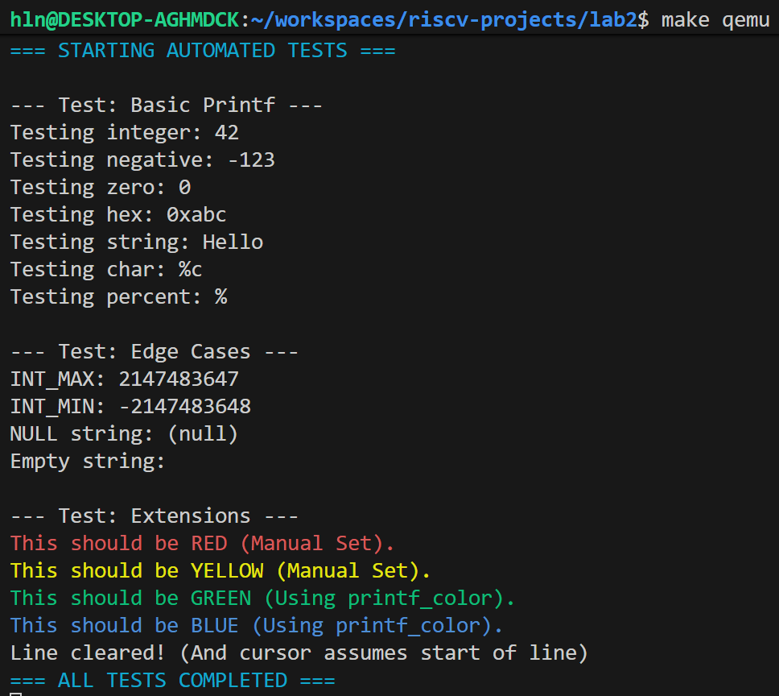

# 实验2：内核printf与清屏功能实现

## 系统设计部分

### 架构设计说明
本实验在实验1（裸机启动 + UART 输出）的基础上，构建了一个功能完整的内核输出子系统。整体采用**三层分层架构**，各层职责明确、解耦清晰：
1. **硬件驱动层（`uart.c`）**：直接操作 RISC-V 平台的 UART MMIO 寄存器（地址 `0x10000000`），提供最底层的字符输出函数 `uart_putc(char c)`。
2. **控制台抽象层（`console.c`）**：封装硬件细节，向上提供统一的 `console_putc(char c)` 接口。该层负责：
   - 将换行符 `\n` 自动转换为 `\r\n` 以适配终端；
   - 解析并执行 ANSI 转义序列，支持清屏、光标定位、清行、文本颜色设置等高级功能。
3. **格式化输出层（`printf.c`）**：实现 `vprintf`、`printf` 和 `printf_color` 函数。通过状态机解析格式字符串，处理可变参数，并调用 `console_putc` 完成最终输出。

此架构使得上层逻辑（如测试代码）无需关心硬件或转义序列细节，仅需调用高层 API 即可完成复杂输出。

### 关键数据结构
- **`va_list`**：来自标准头文件 `<stdarg.h>`，用于遍历 C 语言的可变参数列表，是实现 `printf` 的核心机制。
- **局部字符缓冲区 `char buf[32]`**：在 `printint` 函数内部定义，用于临时存储整数转换后的字符序列。该缓冲区大小足以容纳 32 位整数的最大表示（如 `-2147483648` 共 11 字符），是实现**非递归数字转字符串**的关键。
- **无全局状态结构**：本实验未引入进程、调度等概念，因此未使用类似 `struct context` 的上下文结构体。

### 与xv6对比分析
| 模块/特性         | xv6 原版实现                     | 本实验实现                          | 差异说明与简化理由                     |
|------------------|----------------------------------|-----------------------------------|----------------------------------------|
| 输出架构          | `printf` → `consputc` → `uartputc` | `printf` → `console_putc` → `uart_putc` | 架构思想一致，但本实现在 `console.c` 中直接集成 ANSI 功能，而 xv6 的 console 更侧重输入缓冲与锁机制。 |
| 格式化支持        | 支持 `%d`, `%x`, `%s`, `%p`, `%%` | 支持 `%d`, `%x`, `%s`, `%p`, `%%`    | 功能完全对齐，满足内核调试基本需求。             |
| ANSI 控制台扩展   | ❌ 不支持                         | ✅ 支持清屏、颜色、光标定位、清行       | 作为实验2的扩展要求，利用 QEMU 对 ANSI 的原生支持提升输出表现力。 |
| 输出缓冲          | 有环形输出缓冲区                   | ❌ 无缓冲，字符直出                   | 为简化实验，省略缓冲机制，所有输出均为同步、即时。     |

### 设计决策理由
1. **采用分层架构**：提高代码模块化程度，便于理解、测试与未来扩展（如更换输出设备）。
2. **避免递归实现数字转换**：内核栈空间有限（本实验仅 4KB），递归存在栈溢出风险；循环+缓冲区方案空间复杂度为 O(1)，更安全可靠。
3. **直接集成 ANSI 转义序列**：QEMU 的 `-nographic` 模式天然支持 ANSI，借此可低成本实现彩色输出、清屏等效果，显著提升调试信息可读性。
4. **封装 `printf_color` 函数**：手动拼接 ANSI 序列易出错且冗长；`printf_color` 在打印前后自动插入颜色设置与重置指令，确保颜色作用域隔离，防止污染后续输出。

## 实验过程部分

### 实现步骤记录
1. **实现基础 `printf`**：编写 `vprintf` 核心函数，使用状态机解析格式字符串，完成 `%d`、`%x`、`%s`、`%%` 的处理逻辑，重点实现非递归 `printint`。
2. **对接控制台层**：将 `printf` 输出重定向至 `console_putc`，并确保 `\n` 被正确转换为 `\r\n`。
3. **实现 ANSI 功能**：在 `console.c` 中添加 `console_clear()`、`console_set_color()`、`console_goto_xy()`、`console_clear_line()` 等函数，内部构造并发送标准 ANSI 转义序列。
4. **封装彩色输出接口**：新增 `printf_color(enum color, const char *fmt, ...)`，自动管理颜色开启与重置。
5. **编写自动化测试**：在 `test.c` 中设计三组测试：
   - `test_printf_basic`：验证基础格式化功能；
   - `test_printf_edge_cases`：验证 `INT_MAX` / `INT_MIN` 等边界值；
   - `test_extensions`：验证所有 ANSI 扩展功能（颜色、清屏、清行等）。

### 问题与解决方案
**问题1：`INT_MIN` 打印错误**  
- **现象**：`printf("%d", INT_MIN)` 输出结果不正确。  
- **原因**：在 `printint` 中对负数执行 `x = -xx` 时，`-INT_MIN` 因补码表示溢出（`INT_MAX + 1` 无法用有符号 int 表示）。  
- **解决**：将 `xx` 强制转为 `unsigned int` 后再取负：`x = -(unsigned int)xx;`，利用无符号溢出定义明确的特性正确处理。

**问题2：颜色未重置导致后续输出变色**  
- **现象**：调用 `console_set_color(RED)` 后，后续所有 `printf` 输出均为红色。  
- **原因**：ANSI 颜色设置具有“持续生效”特性，需显式重置。  
- **解决**：引入 `printf_color` 封装，在打印内容前后自动插入 `\033[<color>m` 和 `\033[0m`（重置），实现颜色作用域隔离。

### 源码理解总结
- **`printf` 的状态机本质**：逐字符扫描格式串，遇普通字符直接输出，遇 `%` 则进入格式解析状态，根据下一字符决定如何提取和格式化参数。逻辑简洁高效。
- **ANSI 转义序列的价值**：通过标准化的控制序列（如 `\033[2J` 清屏），可在支持 ANSI 的终端（如 QEMU）中实现丰富的视觉效果，极大增强内核输出的信息密度与可读性。
- **分层设计的工程意义**：硬件变动（如从 UART 切换到 VGA）只需修改底层驱动，上层 `printf` 和测试代码几乎无需改动，体现了高内聚、低耦合的软件设计原则。

## 测试验证部分

### 功能测试结果
- ✅ **基础格式化**：成功输出整数（正/负）、十六进制、字符串、指针、百分号。
- ✅ **边界条件**：正确打印 `INT_MAX (2147483647)` 和 `INT_MIN (-2147483648)`。
- ✅ **ANSI 清屏**：`console_clear()` 成功清空 QEMU 终端屏幕。
- ✅ **文本颜色**：红、黄、绿、蓝等颜色通过 `printf_color` 正确显示。
- ✅ **清除当前行**：`console_clear_line()` 成功清除光标所在行内容。

### 性能数据
本实验未进行专门性能优化或基准测试。当前实现为**字符级同步输出**，每次调用 `console_putc` 均触发 UART 轮询写入，性能非首要目标。

### 异常测试
- **NULL 字符串指针**：`printf("%s", NULL)` 安全输出 `(null)`，系统未崩溃。
- **未知格式符**：`printf("%z", 42)` 安全输出 `%z`，系统未崩溃，符合“尽力而为”策略。

### 运行截图/录屏


## 思考题 (Thinking Questions)

1.  **架构设计**：
    *   **为什么需要分层？每层的职责如何划分？**
        分层是为了**解耦**和**复用**。硬件层只关心如何与物理设备通信；控制台层将硬件操作抽象为逻辑操作（如“清屏”、“设色”），并处理跨平台的细节（如 `\n` 转 `\r\n`）；格式化层则完全专注于字符串处理逻辑。这样，任何一层的改动都不会轻易影响到其他层。
    *   **如果要支持多个输出设备（串口+显示器），架构如何调整？**
        可以在控制台抽象层之下再引入一个“设备驱动层”的概念。`console.c` 不再直接调用 `uart_putc`，而是调用一个更通用的 `device_putc`。然后，系统可以注册多个设备驱动（如 `uart_driver`, `vga_driver`），`device_putc` 会将字符广播给所有已注册的驱动。或者，`console.c` 可以持有一个当前活动的设备指针，通过 `console_set_device` 来切换输出目标。

2.  **算法选择**：
    *   **数字转字符串为什么不用递归？**
        内核栈空间非常宝贵且有限（本实验仅为 4KB）。递归深度与数字的位数成正比，虽然对于 32 位整数最多只有 10 层，风险不大，但作为一种良好的内核编程习惯，应尽可能避免递归，以防在更复杂的情景下引发栈溢出。循环方案是常量空间复杂度，更为安全可靠。
    *   **如何在不使用除法的情况下实现进制转换？**
        对于 2 的幂次方进制（如二进制、八进制、十六进制），可以使用**位运算**代替除法和取模。例如，`x % 16` 等价于 `x & 0xF`，`x / 16` 等价于 `x >> 4`。但对于十进制，由于 10 不是 2 的幂，无法用简单的位运算替代，通常仍需使用除法。

3.  **性能优化**：
    *   **当前实现的性能瓶颈在哪里？**
        最大的瓶颈在于**每次只输出一个字符**。每次调用 `console_putc` 都会触发一次对 UART 的轮询写入，这是一个相对较慢的 I/O 操作。频繁的函数调用本身也有开销。
    *   **如何设计一个高效的缓冲机制？**
        可以在 `console.c` 中引入一个**输出缓冲区**（例如 128 字节）。`console_putc` 不再直接写 UART，而是将字符放入缓冲区。当缓冲区满、遇到 `\n` 或者显式调用 `console_flush` 时，才将整个缓冲区的内容一次性写入 UART。这能显著减少 I/O 操作次数，提升性能。

4.  **错误处理**：
    *   **`printf` 遇到 NULL 指针应该如何处理？**
        本实现在 `printf.c` 中已经处理了这种情况：`if((s = va_arg(ap, char*)) == 0) s = "(null)";`。这是一种安全且友好的做法，避免了因访问非法地址而导致的系统崩溃，并向开发者明确提示了错误。
    *   **格式字符串错误时的恢复策略是什么？**
        本实现在遇到未知的格式符（如 `%z`）时，会原样输出 `'%'` 和该字符（即 `%z`）。这是一种简单的“尽力而为”(best-effort) 策略，保证了程序不会因为格式字符串错误而崩溃，同时也能让开发者注意到格式字符串的问题。
```
