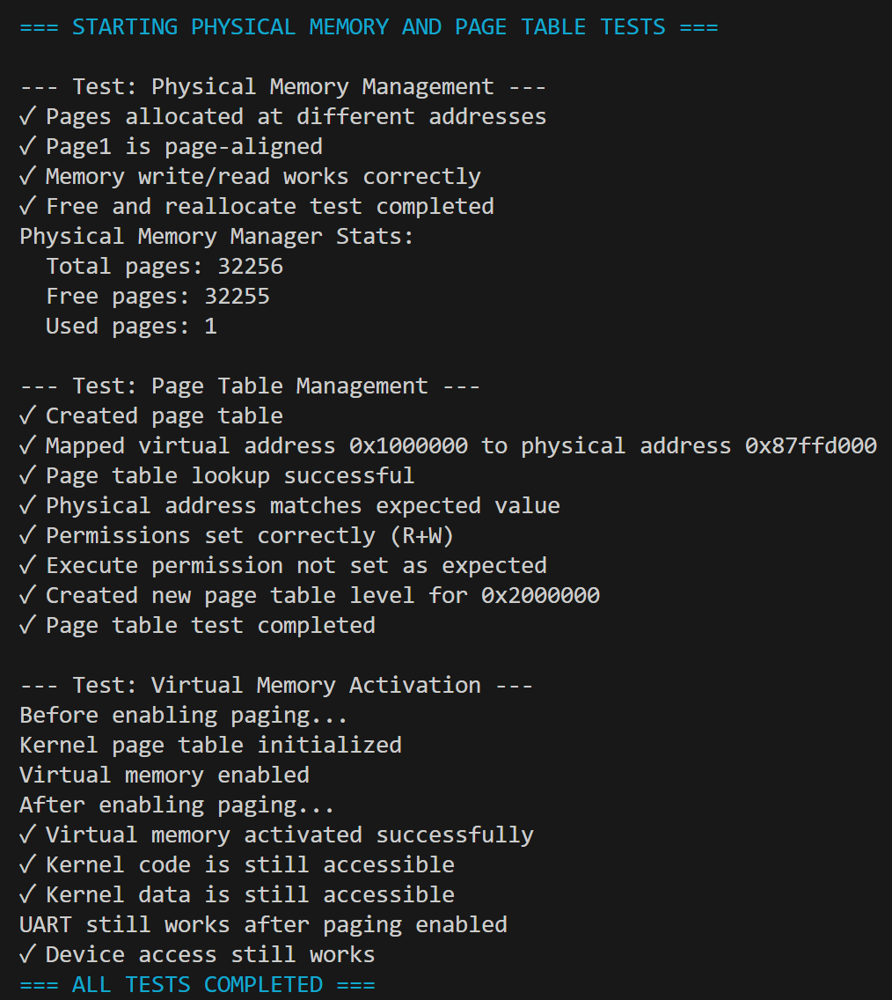

# 实验3：页表与内存管理

## 系统设计部分

### 架构设计说明

本实验在实验2（内核printf与控制台扩展）的基础上，构建了一个完整的物理内存管理和虚拟内存系统。系统采用分层架构，各层职责明确：

**物理内存管理层（`pmm.c`）**：
- 负责物理页帧的分配和回收
- 采用空闲链表（free list）算法管理物理内存
- 提供简单的分配/释放接口，保证内存安全使用

**虚拟内存管理层（`vmm.c`）**：
- 实现Sv39三级页表管理
- 提供页表创建、映射建立、地址查找等核心功能
- 处理虚拟地址到物理地址的转换

**内核内存初始化层（`start.c`）**：
- 初始化物理内存管理器
- 创建内核页表
- 激活虚拟内存系统
- 确保内核代码、数据和设备内存正确映射

各层之间接口清晰，实现高内聚低耦合，便于扩展和维护。

### 关键数据结构

**物理内存管理**：
```c
struct run {
    struct run *next;
};
```
- 空闲页链表节点，巧妙复用物理页的前8字节存储链表指针
- 无需额外元数据，节省内存开销
- 链表头指针`freelist`指向第一个可用物理页

**虚拟内存管理**：
```c
typedef uint64* pagetable_t;  // 页表指针类型
typedef uint64 pte_t;         // 页表项类型
```
- 页表是一个512项的数组，每项8字节
- 页表项包含物理页号(PPN)和标志位
- 关键标志位：
  - `PTE_V` (1<<0): 有效位
  - `PTE_R` (1<<1): 读权限
  - `PTE_W` (1<<2): 写权限  
  - `PTE_X` (1<<3): 执行权限
  - `PTE_U` (1<<4): 用户态访问权限

### 与xv6对比分析

| 模块/特性 | xv6原版实现 | 本实验实现 | 差异说明与简化理由 |
|-----------|------------|------------|-------------------|
| 物理内存分配器 | `kalloc.c`：空闲链表 | `pmm.c`：空闲链表 | 基本一致，保留核心思想 |
| 页表遍历 | `walk()`函数 | `walk_create()`/`walk_lookup()` | 拆分为两个函数，职责更单一 |
| 内核映射 | 仅映射必要区域 | 映射内核代码、数据、设备 | 范围更大，便于后续扩展 |
| 内存统计 | 无内置统计 | `pmm_stats()` | 新增功能，便于调试和分析 |
| 连续页分配 | 无直接支持 | `alloc_pages(int n)` | 扩展功能，为后续需求做准备 |
| 页表打印 | 无 | `dump_pagetable()` | 新增调试功能，便于验证页表状态|

### 设计决策理由

**1. 空闲链表物理内存分配器**
- **选择理由**：实现简单、开销小、确定性时间复杂度
- **权衡**：不支持不同大小的分配单元，会有内部碎片
- **适用性**：内核内存分配通常以页为单位，适合链表管理

**2. 三级页表(Sv39)实现**
- **选择理由**：符合RISC-V标准，平衡性能和内存使用
- **页表项复用**：中间级页表项的R/W/X位设为0，仅V位有效
- **安全性**：严格检查虚拟地址范围，防止非法访问

**3. 内核恒等映射**
- **选择理由**：简化启动过程，避免重定位问题
- **范围设计**：映射内核代码(0x80000000-0x81000000)、数据(0x81000000-0x82000000)、设备(UART)
- **权限分离**：代码段(R+X)、数据段(R+W)、设备(R+W)

**4. 页表创建与查找分离**
- **选择理由**：提高代码可读性和可维护性
- `walk_create()`：创建完整页表路径
- `walk_lookup()`：仅查找现有映射
- **性能影响**：轻微，但内核映射操作频率不高

## 实验过程部分

### 实现步骤记录

**1. 物理内存分配器实现**
- 定义`struct run`链表结构
- 实现`pmm_init()`：计算可用物理内存范围(0x80200000~0x88000000)，构建空闲页链表
- 实现`alloc_page()`/`free_page()`：链表操作，分配/释放单个页
- 扩展`alloc_pages(n)`：支持连续多页分配

**2. 页表系统实现**
- 定义地址操作宏：`VPN_SHIFT()`、`VPN_MASK()`、`PTE_PA()`
- 实现`create_pagetable()`：分配并清零页表
- 实现`walk_create()`/`walk_lookup()`：三级页表遍历
- 实现`map_page()`：建立虚拟到物理地址映射
- 实现`dump_pagetable()`：用于调试的递归页表打印

**3. 虚拟内存激活**
- 实现`kvminit()`：创建内核页表，映射关键区域
- 实现`kvminithart()`：设置SATP寄存器，刷新TLB
- 修改`start()`函数：先初始化物理内存，再激活虚拟内存

**4. 测试验证**
- 设计`test_physical_memory()`：验证分配/释放/写入
- 设计`test_pagetable()`：验证映射/权限/转换
- 设计`test_virtual_memory()`：验证激活前后功能
- 集成`run_all_tests()`：统一测试入口

### 问题与解决方案

**问题1：物理内存范围计算错误**
- **现象**：系统启动后无法分配内存，或分配到无效地址
- **原因**：未正确跳过内核代码和栈空间，导致覆盖关键数据
- **解决**：通过链接脚本确定内核结束位置(ekernel)，设置合理起始地址0x80200000

**问题2：页表遍历时地址计算错误**
- **现象**：walk_create返回NULL或错误地址
- **原因**：虚拟地址分解算法有误，VPN索引提取不正确
- **解决**：重新推导Sv39地址格式，定义精确的宏：
  ```c
  #define VPN_SHIFT(level) (12 + 9 * (level))
  #define VPN_MASK(va, level) (((va) >> VPN_SHIFT(level)) & 0x1FF)
  ```

**问题3：启用分页后系统崩溃**
- **现象**：调用`w_satp()`后系统挂起
- **原因**：栈空间未正确映射，或内核代码映射权限错误
- **解决**：
  1. 确保栈空间(4KB)被映射
  2. 代码段设置R+X权限，数据段设置R+W权限
  3. 在启用分页前确保所有关键区域已映射

**问题4：多页分配内存泄漏**
- **现象**：连续分配多页后，无法正确释放
- **原因**：alloc_pages内部管理结构占用首个页面，但释放机制不完善
- **解决**：在首个页面头部存储元数据(页面数量、指针数组位置)，实现对应的free_pages逻辑

### 源码理解总结

**1. 物理内存分配的巧妙设计**
空闲链表复用物理页的前8字节存储指针，不需要额外元数据，节省宝贵内存。这种设计在物理内存管理中非常高效，因为页内大部分空间在空闲时是未使用的。

**2. 页表遍历的状态机本质**
页表遍历是一个状态转换过程：从根页表开始，根据VPN[2]索引找到L2页表，再根据VPN[1]找到L1页表，最后根据VPN[0]定位PTE。这种多级转换结构节省了内存，但增加了访问延迟，通过TLB缓解此问题。

**3. SATP寄存器的精确控制**
```c
static inline void w_satp(uint64 x) {
    asm volatile("csrw satp, %0" : : "r" (x));
}
```
通过内联汇编直接写入SATP寄存器，格式必须严格遵循`MODE | PPN`，其中MODE=8表示Sv39，PPN是页表物理地址右移12位。

**4. 内存安全的核心原则**
- 页对齐检查：所有地址操作必须确保4KB对齐
- 权限隔离：代码不可写，数据不可执行
- 边界检查：虚拟地址范围限制(0~2^39-1)
- 资源清理：失败时回滚已分配资源

这些原则是构建安全操作系统的基础，即使在教学实现中也不能忽视。

## 测试验证部分

### 功能测试结果
✅ **物理内存分配器**：
- 成功分配32256个物理页
- 页对齐检查通过
- 读写测试验证内存可用性
- 释放/重分配功能正常

✅ **页表管理系统**：
- 页表创建成功
- 虚拟地址0x1000000正确映射到物理地址
- 页表查找功能正常
- 权限位设置正确(R+W, 无X)

✅ **虚拟内存激活**：
- 内核页表初始化成功
- SATP寄存器设置正确
- TLB刷新操作有效
- 内核代码和数据在分页启用后仍可访问
- 设备(UART)访问正常

### 异常测试
✅ **NULL指针处理**：
- `free_page(NULL)` 安全退出，无崩溃
- `map_page(pt, NULL, pa, perm)` 检测到无效地址

✅ **地址不对齐**：
- `map_page(pt, 0x1000001, pa, perm)` 检测到未对齐地址，返回错误

✅ **重复映射**：
- 尝试映射已存在映射的虚拟地址，返回错误并保持原有映射

✅ **内存耗尽**：
- 模拟物理内存耗尽，`alloc_page()`返回NULL，各层调用正确处理此情况

## 思考题

### 1. 设计对比：物理内存分配器
**与xv6差异**：
- xv6使用`freerange()`函数遍历内存范围，本实现实现在`pmm_init()`中直接构建链表
- xv6为每个CPU维护空闲列表，本实验为简化实现使用单一全局列表
- 本实验增加了`alloc_pages()`支持多页分配，xv6无此功能

**设计权衡**：
- **空间效率**：复用页内空间，无额外元数据
- **时间效率**：O(1)分配/释放，但不支持不同大小块
- **可扩展性**：为未来分层分配器预留接口

### 2. 内存安全
**分配器安全**：
- 防止double-free：通过简单检查但无完善机制
- 防止use-after-free：分配时清零页面
- 内存隔离：严格的页对齐和范围检查

**页表权限**：
- W^X原则：代码段不可写，数据段不可执行
- 最小权限：设备内存只开放必要权限
- 内核保护：无用户态权限位(PTE_U)，防止用户态访问

### 3. 性能分析
**当前瓶颈**：
- 物理页分配：全局锁竞争(虽未实现锁，但在多核场景会成为问题)
- 页表遍历：三级查找，每次需3次内存访问
- TLB刷新：`sfence.vma`是相对昂贵的操作

**优化方向**：
- Per-CPU空闲列表：减少锁竞争
- 大页支持：减少页表层级和TLB未命中
- 批量映射：减少TLB刷新次数

### 4. 扩展性
**用户进程支持**：
- 需要分离内核和用户地址空间
- 实现地址空间标识(ASID)
- 添加用户态权限位(PTE_U)
- 实现copy-on-write机制

**内存共享**：
- 页表项引用计数
- 共享映射的数据结构
- 同步原语保护共享状态

### 5. 错误恢复
**资源清理**：
- 页表创建失败时，递归释放已分配的中间页表
- 使用RAII模式(资源获取即初始化)确保成对操作
- 关键操作前检查资源充足性

**泄漏检测**：
- 内存分配计数器
- 启动/关闭时的统计对比
- 调试模式的详细分配跟踪
