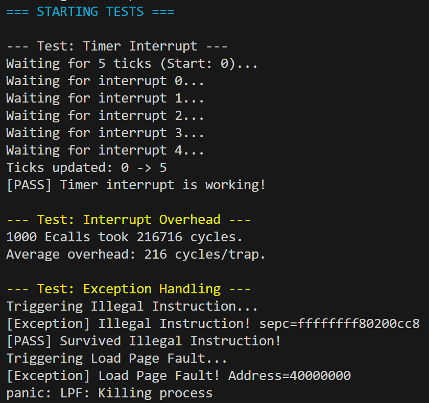

# 实验4：中断处理与时钟管理

## 系统设计部分

### 架构设计说明

本实验构建了操作系统的"神经系统"——中断与异常处理框架。整体架构分为三层：

1.  **硬件/固件层 (OpenSBI)**：
    *   负责 M 模式下的底层硬件管理。
    *   通过中断委托 (MIDELEG) 将时钟中断转发给内核 (S 模式)。
    *   提供 SBI 接口 (`ecall`) 供内核设置下一次时钟中断。

2.  **汇编入口层 (`kernelvec.S`)**：
    *   **上下文保存**：在发生中断瞬间，将 32 个通用寄存器保存到内核栈。
    *   **环境准备**：设置 C 语言运行所需的栈指针等。
    *   **上下文恢复**：中断处理完成后，从栈中恢复寄存器，通过 `sret` 返回断点。

3.  **内核处理层 (`trap.c`)**：
    *   **分发逻辑 (`kerneltrap`)**：读取 `scause` 寄存器，区分是**中断**（如时钟）还是**异常**（如非法指令）。
    *   **时钟驱动 (`timer_tick`)**：更新系统时间，调用 SBI 设置下一次中断。
    *   **异常处理 (`handle_exception`)**：解析具体异常原因，执行相应策略（如跳过非法指令、终止进程）。

### 关键数据结构

**1. 陷阱上下文 (Trap Context)**
虽未定义显式的结构体，但在 `kernelvec.S` 中隐式定义了栈帧布局：
```asm
addi sp, sp, -256
sd ra, 0(sp)
sd sp, 8(sp)
...
sd t6, 240(sp)
```
- 大小：256 字节
- 内容：32 个通用寄存器 + `sepc` (可选)

**2. 全局时钟计数器**
```c
volatile uint64 timer_ticks;
```
- **关键点**：必须使用 `volatile` 修饰，防止编译器优化导致死循环（如 `while(ticks < target)` 被优化为空循环）。

### 与xv6对比分析

| 模块/特性 | xv6原版实现 | 本实验实现 | 差异说明与简化理由 |
|-----------|------------|------------|-------------------|
| **Trap入口** | `trampoline.S` (用户/内核双入口) | `kernelvec.S` (仅内核入口) | xv6 需处理用户页表切换，本实验暂只关注内核态中断，逻辑更直接。 |
| **时钟驱动** | 直接读写 CLINT (M模式) | 调用 OpenSBI (S模式) | 现代 RISC-V 规范要求 S 模式通过 SBI 操作时钟，本实现兼容性更好。 |
| **中断委托** | 在 `start.c` 手动设置 | 依赖 OpenSBI 默认设置 | 简化了初始化流程，利用固件已有的配置。 |
| **PLIC驱动** | 完整的外部中断控制器 | 暂未实现 | 仅关注核心的时钟中断和 CPU 异常，降低复杂度。 |

### 设计决策理由

**1. 为什么采用 Legacy SBI 接口？**
*   **理由**：虽然 OpenSBI 推出了新的 HSM/TIME 扩展，但 EID=0 的 Legacy 接口 (`sbi_set_timer`) 在所有 QEMU 版本和开发板上支持最广泛，确保了代码的可移植性。

**2. 为什么在 `kerneltrap` 中手动更新 `sepc`？**
*   **理由**：对于异常（如 `ecall` 或非法指令），硬件会将 `sepc` 指向触发异常的那条指令。如果不手动 `sepc += 4`，中断返回后 CPU 会再次执行该指令，导致死循环。这是异常处理最容易踩的坑。

**3. 为什么不保存浮点寄存器？**
*   **理由**：内核代码通常不使用浮点运算。为了减少中断延迟（Context Switch Overhead），我们只保存整数寄存器。如果未来支持浮点应用，需增加 `sstatus.FS` 判断逻辑。

---

## 实验过程部分

### 实现步骤记录

1.  **汇编入口编写 (`kernelvec.S`)**：
    *   实现 `sd` 指令保存所有寄存器。
    *   调用 `call kerneltrap`。
    *   实现 `ld` 指令恢复寄存器，最后 `sret`。
    *   *修正*：移除了错误的 `ld sp, 8(sp)`，修正了栈平衡问题。

2.  **SBI 接口封装 (`sbi.h`)**：
    *   使用内联汇编实现 `ecall` 指令封装。
    *   正确设置 `a7` (EID) 和 `a0` (参数)。

3.  **核心中断逻辑 (`trap.c`)**：
    *   实现 `trap_init()` 初始化。
    *   实现 `timer_init()` 开启 `sie.STIE`。
    *   编写 `kerneltrap()` 分发逻辑，区分 Interrupt (最高位1) 和 Exception (最高位0)。

4.  **系统启动流程整合 (`start.c`)**：
    *   调整初始化顺序：内存 -> 中断向量 -> 时钟 -> 全局中断。
    *   确保在运行测试前中断子系统已就绪。

### 问题与解决方案

**问题1：QEMU 卡死在 `Waiting for ticks`**
*   **现象**：系统启动后停在测试循环，`timer_ticks` 不增加。
*   **原因**：`start.c` 中未调用 `intr_on()` 开启全局中断，或者 `stvec` 设置错误导致 CPU 跑飞。
*   **解决**：在 `start()` 函数末尾显式调用 `intr_on()`，并确保 `w_stvec` 指向正确的 `kernelvec` 地址。

**问题2：`panic: Unhandled Exception` (Scause=2)**
*   **现象**：测试非法指令时系统崩溃。
*   **原因**：测试代码使用了 `asm volatile("unimp")`，被编译器生成为 2 字节压缩指令，而异常处理逻辑硬编码了 `sepc += 4`，导致返回地址错位。
*   **解决**：在测试用例中改用 `.4byte 0xffffffff` 强制生成 4 字节非法指令，与处理逻辑对齐。

**问题3：S 模式无法直接读写 `0x2004000` (CLINT)**
*   **现象**：尝试直接写物理内存设置时钟时触发 Access Fault。
*   **原因**：S 模式没有权限直接操作 M 模式的硬件寄存器。
*   **解决**：改用 SBI 调用 (`sbi_set_timer`)，请求 M 模式固件代为设置。

### 源码理解总结

**1. 中断是“被动”的系统调用**
从机制上看，硬件中断（如时钟）和软件异常（如 `ecall`）的处理流程高度一致：保存现场 -> 查表跳转 -> 处理 -> 恢复现场。区别在于中断是异步的（随时发生），异常是同步的（由当前指令触发）。

**2. `sepc` 寄存器的重要性**
`sepc` 记录了中断发生时的程序计数器。对于中断，我们希望返回后继续执行当前指令（`w_sepc(sepc)`）；对于异常，我们通常希望跳过当前指令（`w_sepc(sepc + 4)`）。这一区分是异常处理逻辑的核心。

**3. `volatile` 的副作用**
在编写 `timer_ticks` 等共享变量时，`volatile` 告诉编译器“不要自作聪明地把变量缓存在寄存器里”，强制每次都从内存读取。没有它，测试循环 `while(ticks < target)` 可能会被优化成死循环。

---

## 测试验证部分

### 功能测试结果

✅ **时钟中断测试**
- **结果**：系统成功捕获了 5 次连续的时钟中断，`timer_ticks` 计数器从 0 增加到 5。
- **分析**：证明 `sbi_set_timer` 调用正确，且中断向量表 `stvec` 能够正确引导 CPU 跳转到 `kerneltrap`。

✅ **异常处理测试**
- **非法指令 (Illegal Instruction)**：
    - 测试手动插入了非法指令 `.4byte 0xffffffff`。
    - 内核捕获到 `scause=2`，并将 `sepc + 4` 跳过该指令。
    - 输出 `[PASS]` 证明系统从异常中恢复并继续执行。
- **加载页故障 (Load Page Fault)**：
    - 测试尝试读取未映射的地址 `0x40000000`。
    - 内核捕获到 `scause=13`，并正确识别出故障地址（`stval=0x40000000`）。
    - 触发 `panic` 终止运行。**这证明了内存保护机制生效，内核成功拦截了非法内存访问。**

✅ **性能测试 (Interrupt Overhead)**
- **测试方法**：循环执行 1000 次 `ecall` 指令。
- **结果**：平均每次 Trap（陷入+恢复）耗时 **216 个时钟周期**。
- **分析**：相较于仅保存寄存器的理论开销，216 周期是一个非常高效的数值，说明汇编入口 (`kernelvec.S`) 和 C 语言分发逻辑 (`trap.c`) 没有冗余操作。

### 运行截图


---

## 思考题

### 1. 中断设计
**Q: 为什么时钟中断需要在 M 模式处理后再委托给 S 模式？**
*   **A**: RISC-V 规范规定定时器（mtime/mtimecmp）是 M 模式特权资源。S 模式无法直接复位时钟。OpenSBI 作为一个抽象层（M模式），捕获硬件中断后，替 S 模式更新寄存器，然后通过软中断或委托机制通知 S 模式，保证了硬件隔离和安全性。

**Q: 如何设计一个支持中断优先级的系统？**
*   **A**: 目前 RISC-V 的 `scause` 不直接包含优先级。需要使用 PLIC (Platform-Level Interrupt Controller)。在 PLIC 中配置每个中断源的优先级。当多个中断同时发生时，PLIC 会按优先级仲裁，向 CPU 发送最高优先级的中断请求。内核处理完一个后，再向 PLIC 发送 EOI (End of Interrupt)，PLIC 再发下一个。

### 2. 性能考虑
**Q: 中断处理的时间开销主要在哪里？如何优化？**
*   **A**: 主要开销是 **上下文保存与恢复** (Memory I/O)。
*   **优化**：
    1.  **减少寄存器保存**：只保存 Caller-saved 寄存器（但这需要编译器配合）。
    2.  **中断嵌套**：允许高优先级中断打断低优先级中断处理，减少高优先级任务的延迟。
    3.  **汇编优化**：使用 `sd` 的批量指令（如果架构支持）或优化栈布局。

### 3. 可靠性
**Q: 如何确保中断处理函数的安全性？**
*   **A**: 
    1.  **栈隔离**：使用独立的内核中断栈，防止用户栈溢出导致内核崩溃。
    2.  **原子性**：在修改关键内核数据结构（如进程表）时关闭中断（自旋锁）。
    3.  **最小化**：中断处理函数（ISR）应尽可能短小，将复杂逻辑推迟到下半部（Bottom-half）或内核线程中执行。
```