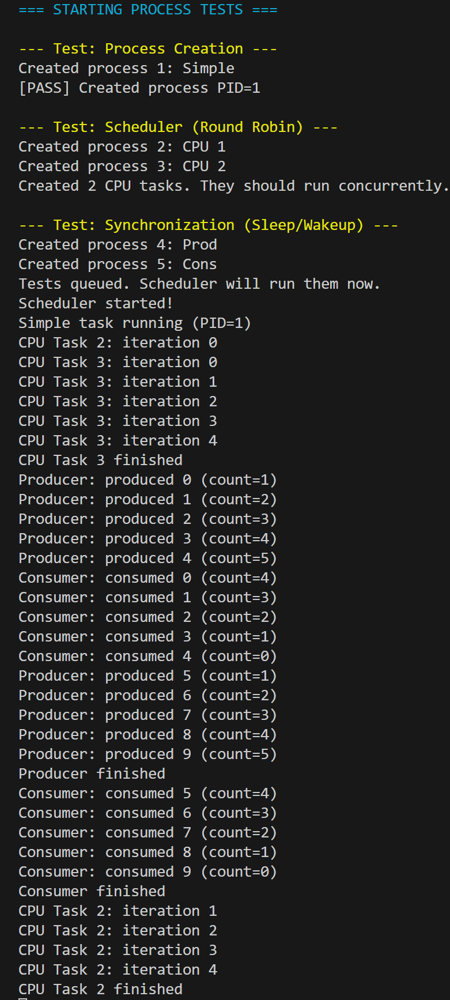

# 实验5：进程管理与调度

## 系统设计部分

### 架构设计说明

本实验实现了操作系统的核心——多任务调度系统。

1.  **进程模型**：
    *   采用 **内核线程 (Kernel Thread)** 模型。
    *   每个进程拥有独立的内核栈（4KB，由 `pmm` 分配）和上下文结构。
    *   暂时不涉及用户态空间，所有任务运行在 S 模式。

2.  **调度系统**：
    *   **调度策略**：时间片轮转 (Round-Robin)。
    *   **调度时机**：
        *   主动调度：进程调用 `yield()` 或 `sleep()`。
        *   抢占调度：时钟中断处理函数 `timer_tick()` 强制调用 `yield()`。
    *   **调度器实体**：`scheduler()` 函数运行在每个 CPU 独有的调度上下文 (`scheduler_context`) 中。

3.  **同步机制**：
    *   基于 `sleep/wakeup` 的条件变量机制。
    *   利用 `swtch` 原子性地让出 CPU 并进入睡眠状态。

### 关键数据结构

**1. 进程控制块 (`struct proc`)**
```c
struct proc {
    enum procstate state;    // 状态：RUNNING, RUNNABLE, SLEEPING...
    int pid;                 // 进程ID
    void *kstack;            // 内核栈物理地址
    struct context context;  // 保存 ra, sp, s0-s11
    void *chan;              // 休眠等待的通道
    char name[16];           // 调试名称
};
```

**2. 上下文结构 (`struct context`)**
仅保存 **Callee-saved** (被调用者保存) 寄存器。
*   `ra`: 返回地址。`swtch` 返回时，CPU 会跳转到这里。
*   `sp`: 栈指针。切换后，代码将在新进程的栈上运行。
*   `s0-s11`: C 语言约定函数调用期间必须保持不变的寄存器。

### 与xv6对比分析

| 模块 | xv6原版实现 | 本实验实现 | 差异说明 |
| :--- | :--- | :--- | :--- |
| **进程状态** | 复杂的锁机制 (`p->lock`) 保护状态 | 关中断 / 简化锁 | 本实验为单核环境，暂未引入自旋锁，通过逻辑保证安全性。 |
| **首次调度** | 构造 `forkret` 栈帧 | 手动设置 `context.ra` | 我们直接将 `context.ra` 指向任务入口函数，逻辑更直观。 |
| **进程0** | 手动构造二进制代码 | `create_kernel_process` | 直接使用内核 C 函数作为进程代码，无需加载 ELF。 |

### 设计决策理由

**1. 为什么 `swtch` 只保存 14 个寄存器？**
RISC-V 有 32 个通用寄存器。但 `swtch` 是作为一个 C 函数被调用的。根据调用约定（Calling Convention），调用者（Caller）负责保存临时寄存器（t0-t6, a0-a7）。`swtch` 只需要保证把自己这一层用到的寄存器（s0-s11, ra, sp）复原即可。这大大提高了上下文切换的效率。

**2. 为什么调度器需要独立的上下文？**
如果进程 A 直接切换到进程 B，一旦所有进程都休眠了，CPU 栈指针停在哪里？为了稳健性，我们设计了 `scheduler` 线程。所有进程切换都遵循：Process A -> Scheduler -> Process B。Scheduler 拥有自己独立的栈，确保系统永远有底。

---

## 实验过程部分

### 实现步骤记录

1.  **定义 PCB**：在 `proc.h` 中设计 `struct proc`，包含内核栈指针和上下文。
2.  **实现 `swtch.S`**：编写汇编代码，利用 `sd` 和 `ld` 指令组实现寄存器集的原子交换。
3.  **初始化进程系统**：在 `proc.c` 中实现 `alloc_proc`，利用 Lab 3 的 `alloc_page` 为每个进程分配 4KB 栈空间。
4.  **伪造上下文**：在 `create_kernel_process` 中，将新进程的 `ra` 设置为函数入口，`sp` 设置为栈顶。这样第一次调度时，`ret` 指令就会"返回"到任务函数的开头。
5.  **实现调度与同步**：编写 `scheduler` 主循环，并实现 `sleep/wakeup` 用于进程间同步。

### 问题与解决方案

**问题1：链接错误 `implicit declaration of function 'swtch'`**
*   **现象**：Make 编译失败。
*   **原因**：C 代码调用汇编函数，缺少头文件声明。
*   **解决**：在 `proc.h` 中添加 `extern void swtch(...)` 声明。

**问题2：Load Page Fault (地址 0x87fec000)**
*   **现象**：创建进程分配栈时触发缺页异常。
*   **原因**：物理内存分配器返回了高地址内存，而 Lab 3 的页表只映射了低地址内核段。
*   **解决**：修改 `vmm.c` 中的 `kvminit`，将内核页表映射范围扩大到整个物理内存 (`PHYSTOP`)。

**问题3：无法切回第一个进程 (死锁)**
*   **现象**：任务 A 切换到 B 后，一直运行 B，无法切回 A。
*   **原因**：时钟中断处理会关闭全局中断。`swtch` 保存了关中断的状态。如果调度器循环中不手动开中断，新任务启动时也会处于关中断状态，导致无法响应后续时钟。
*   **解决**：在 `scheduler()` 循环内部显式调用 `intr_on()`。

### 源码理解总结

**sleep/wakeup 的魔法**
`sleep` 的核心不仅是把状态改为 `SLEEPING`，更重要的是它调用了 `swtch`。这意味着：**调用 sleep 的函数会“停”在那一行**。直到未来某个时刻，另一个进程调用 `wakeup` 找到它，将其改为 `RUNNABLE`，调度器再次选中它，它才会从 `swtch` 返回，继续执行下一行代码。这就是同步的本质。

---

## 测试验证部分

### 功能测试结果

✅ **进程创建**
- 成功创建 PID 1 (Simple), PID 2 (CPU1), PID 3 (CPU2), PID 4 (Prod), PID 5 (Cons)。
- 验证了 `alloc_page` 为每个进程分配了独立的内核栈。

✅ **轮转调度 (Round-Robin)**
- 两个 CPU 密集型任务（CPU 1 和 CPU 2）在日志中交替输出。
- 证明时钟中断成功触发了 `yield()`，实现了抢占。

✅ **同步机制 (Producer/Consumer)**
- **生产者**：在 `count=5` 时停止生产（进入睡眠）。
- **消费者**：在生产者睡眠后接管 CPU，消费数据直到 `count=0`。
- **互斥与唤醒**：双方配合默契，无死锁，无缓冲区溢出。

### 运行截图



---

## 思考题

**1. 进程模型：为什么选择这种设计？**
目前采用的是 **1:1 线程模型**（一个用户线程对应一个内核线程），但在本实验阶段简化为纯内核线程。这种设计简单直观，调度器直接管理所有执行流。如果要支持轻量级线程（LWP），可以在 `struct proc` 下挂载多个 `struct thread`，共享内存空间 (`pagetable`) 但拥有独立的栈和上下文。

**2. 调度策略：公平性如何？**
轮转调度 (RR) 提供了最基本的公平性，每个进程获得相同的时间片。但在实际场景中，I/O 密集型进程（如等待键盘输入）会频繁放弃 CPU，导致其利用率低。改进方案是引入 **多级反馈队列 (MLFQ)**，提升 I/O 密集型任务的优先级。

**3. 性能优化：上下文切换开销**
目前的 `swtch` 保存了 14 个寄存器，加上中断进入/退出的保存，开销约为 200-300 周期。优化方向：
*   利用 RISC-V 的浮点寄存器禁用位 (`sstatus.FS`)，避免不必要的浮点寄存器保存。
*   使用大页映射内核栈，减少 TLB Miss。
```