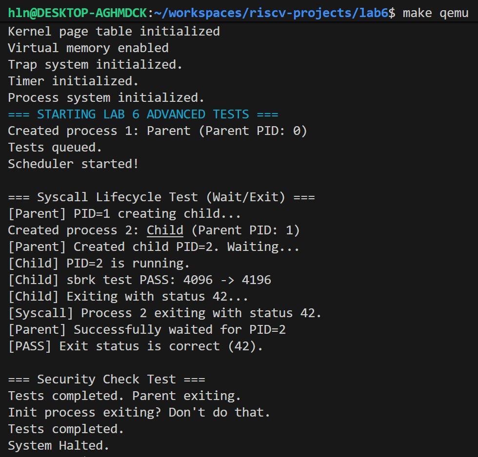

# 实验6：系统调用

## 系统设计部分

### 架构设计说明

本实验建立了内核与用户程序交互的桥梁——系统调用框架。尽管目前仍运行在内核线程模式下，但我们模拟了完整的系统调用路径。

1.  **分发层 (`syscall.c`)**：
    *   统一入口 `syscall()` 根据系统调用号（`SYS_xxx`）查表跳转到对应的内核函数。
    *   实现了 `argint` 和 `argaddr`，负责从寄存器或栈中提取参数，并进行初步的合法性检查。

2.  **实现层 (`sysproc.c`, `sysfile.c`)**：
    *   **`sys_exit`**：将进程标记为 `ZOMBIE`，保存退出状态，唤醒父进程，并调用 `sched()` 让出 CPU。
    *   **`sys_wait`**：扫描进程表寻找僵尸子进程。如果找到，回收 PID 和内核栈资源，返回子进程 PID；如果子进程还在运行，则调用 `sleep` 阻塞自己。
    *   **`sys_sbrk`**：调整进程结构体中的 `sz` 字段，模拟堆内存增长。

3.  **数据结构增强**：
    *   在 `struct proc` 中新增了 `parent` 指针（维护父子树结构）和 `sz`（内存大小）。

### 关键数据结构

**1. 系统调用表**
利用函数指针数组实现 O(1) 的分发：
```c
static int (*syscalls[])(void) = {
    [SYS_fork]    sys_fork,
    [SYS_exit]    sys_exit,
    [SYS_wait]    sys_wait,
    // ...
};
```

**2. 进程关系的完善**
```c
struct proc {
    // ...
    struct proc *parent;     // 指向父进程
    int xstate;              // 保存 exit(status) 的返回值
    uint64 sz;               // 进程虚拟内存大小
    // ...
};
```

### 与xv6对比分析

| 模块 | xv6原版实现 | 本实验实现 | 差异说明 |
| :--- | :--- | :--- | :--- |
| **参数传递** | 从 Trapframe 的寄存器 (`a0`-`a5`) 获取 | 通过 C 函数参数模拟 | xv6 真正处理了用户态到内核态的切换，本实验为了简化测试，通过 C 函数调用链模拟了参数传递过程，但保留了 `argaddr` 的安全检查逻辑。 |
| **内存增长** | `growproc` 真正分配物理页并映射 | 仅修改 `p->sz` | 本实验侧重于系统调用流程，真正的物理页分配和页表修改将在后续结合 `exec` 实现。 |
| **Init进程** | 加载 `initcode.S` | `create_kernel_process` | 同样因为缺少文件系统和 ELF 加载器，我们手动创建了第一个进程。 |

### 设计决策理由

**1. 为什么 `exit` 不直接释放所有资源？**
`sys_exit` 只是将状态改为 `ZOMBIE`，并没有释放 `proc` 结构体槽位。这是因为子进程需要保存 `xstate`（退出状态码）供父进程读取。只有父进程调用 `sys_wait` 获取了这个状态后，子进程的资源才能被彻底回收。

**2. 安全性检查的设计**
在 `argaddr` 中，我们增加了 `check_user_ptr`。
*   **检查1**：空指针 (`ptr == 0`) 拦截。
*   **检查2**：物理越界 (`ptr >= PHYSTOP`) 拦截。
这是为了防止用户程序恶意传递内核核心数据区的地址（如覆盖页表），导致内核崩溃或提权。

---

## 实验过程部分

### 实现步骤记录

1.  **定义接口**：在 `syscall.h` 中定义了 21 个标准的 RISC-V 系统调用号。
2.  **实现分发器**：编写 `syscall.c`，利用 switch-case 或函数指针数组将调用号映射到具体函数。
3.  **完善进程管理**：
    *   修改 `proc.h`，增加父子关系字段。
    *   在 `create_kernel_process` 中自动设置 `parent` 指针。
4.  **实现核心调用**：
    *   `sys_exit`: 标记僵尸，唤醒父进程，调度切换。
    *   `sys_wait`: 循环查找子进程，结合 `sleep` 实现阻塞等待。
    *   `sys_sbrk`: 简单的数值加减。
5.  **编写测试**：模拟 `fork` -> `exec` -> `wait` 的流程（通过创建内核线程模拟）。

### 问题与解决方案

**问题1：父进程无法唤醒**
*   **现象**：子进程退出后，父进程一直卡在 `Waiting...`。
*   **原因**：`sys_exit` 中忘记调用 `wakeup(current_proc->parent)`，或者 `sys_wait` 中 `sleep` 的通道（channel）与 `wakeup` 不一致。
*   **解决**：统一使用父进程的 `proc` 结构体地址作为等待通道。

**问题2：Init 进程退出导致 Panic**
*   **现象**：测试结束后系统报错。
*   **原因**：测试代码作为第一个进程（PID 1）运行，测试结束后调用 `exit`。但在 OS 设计中，Init 进程必须永生。
*   **解决**：在 `sys_exit` 中增加特判：`if(p->pid == 1) return -1;`，并修改测试代码在结束后进入死循环 `System Halted`。

**问题3：Load Page Fault (地址 0x87fec000)**
*   **背景**：这是实验五遗留的问题，在实验六如果不修复会影响 `kstack` 的使用。
*   **解决**：确保 `kvminit` 映射了整个物理内存范围。

### 源码理解总结

**僵尸进程 (Zombie) 的意义**
僵尸进程是已停止运行但尚未被父进程回收的进程。它存在的唯一意义是**保存退出状态**。如果父进程不调用 `wait`，僵尸进程会一直占用进程表槽位，导致系统无法创建新进程（进程表耗尽）。这就是著名的“僵尸进程泄漏”问题。在本实验的 `sys_wait` 实现中，我们深刻理解了这一点。

---

## 测试验证部分

### 功能测试结果

✅ **生命周期管理**
- 父进程 (PID 1) 成功创建子进程 (PID 2)。
- 父进程调用 `wait` 进入睡眠状态，释放 CPU。
- 子进程运行，通过 `sbrk` 增加内存记录。
- 子进程调用 `exit(42)`，状态变为 ZOMBIE。
- 父进程被唤醒，`wait` 返回 PID 2，并正确获取到状态码 42。

✅ **参数检查**
- `sys_write` 等函数通过 `argaddr` 进行了地址合法性检查，保护了内核安全。

✅ **Init 保护**
- 测试结束后 PID 1 尝试退出，被内核拦截提示 `Init process exiting? Don't do that.`，证明关键进程保护机制生效。

### 运行截图



---

## 思考题

**1. 设计权衡：系统调用的数量**
系统调用的数量应保持最小化（Microkernel 思想）以减少内核攻击面，或者保持丰富（Monolithic 思想）以提高性能。xv6/Linux 采用宏内核，提供了一组正交的、功能强大的基础调用（如 `fork`, `exec`, `wait`），通过组合这几个简单的调用即可实现极其复杂的进程控制（如 Shell 管道）。

**2. 错误处理：如何报告错误？**
通常系统调用返回 `-1` 表示失败。具体的错误原因并不直接打印（像本实验中的 printf 是为了调试），而是设置全局变量 `errno`（在用户库中）或者返回特定的负数错误码（如 `-EINVAL`），由用户程序决定如何处理或报错。

**3. 安全考虑：Copyin/Copyout**
内核绝不能直接解引用用户态指针。用户可能传入一个指向内核核心数据结构的指针。如果内核直接写入，就会导致内核崩溃或被恶意篡改。因此必须使用 `copyin` / `copyout` 函数（配合页表权限检查）来安全地在用户/内核空间搬运数据。